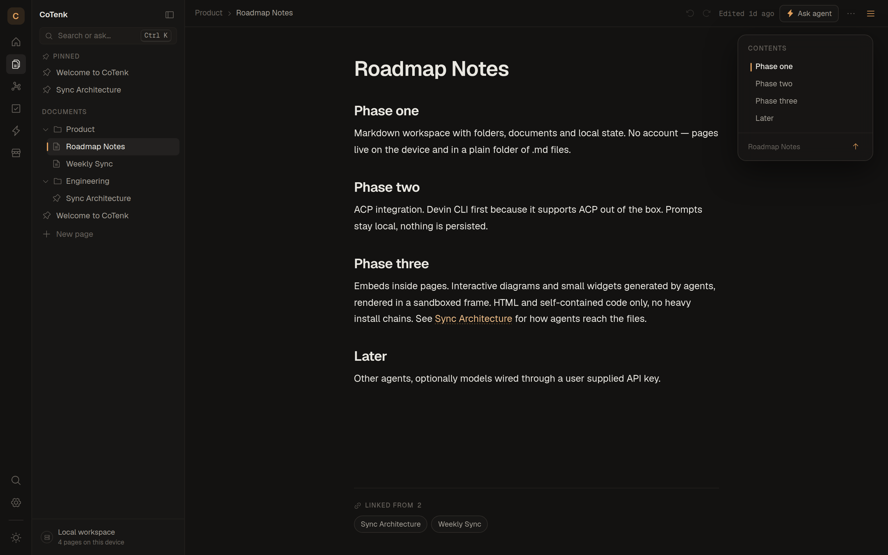
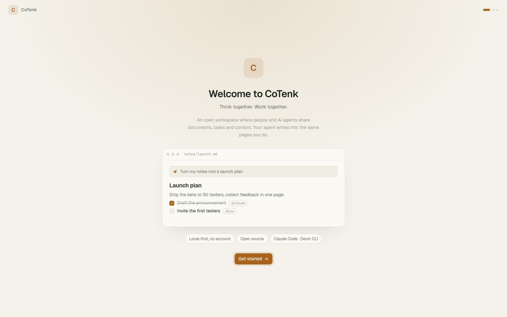
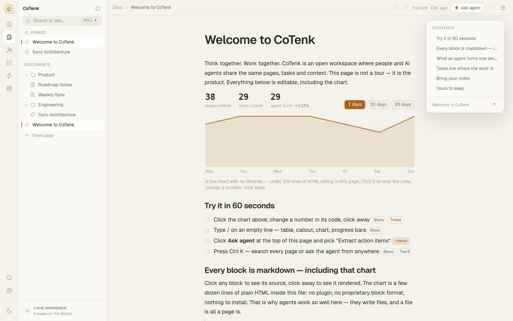
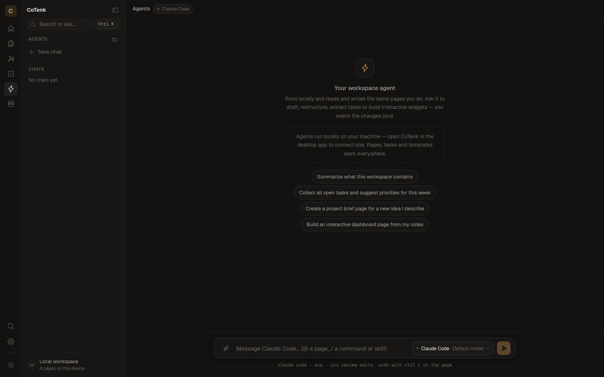
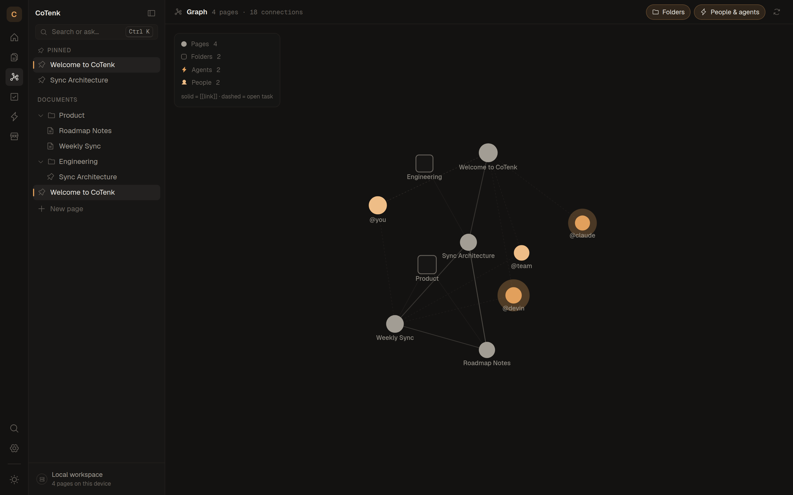
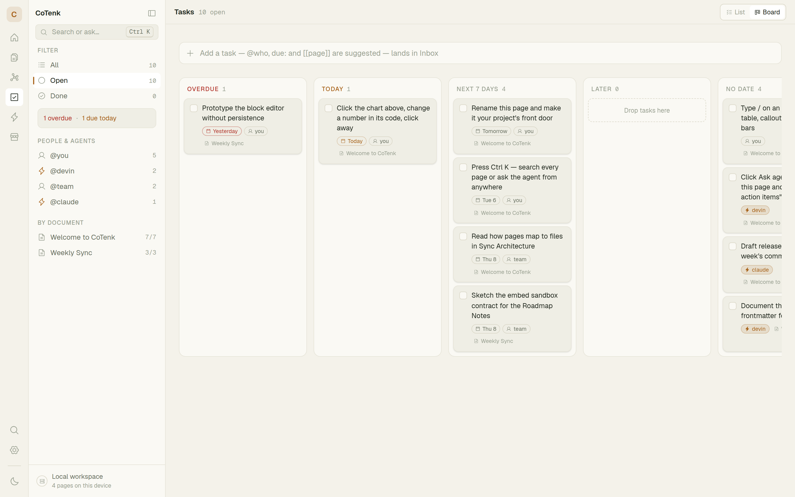
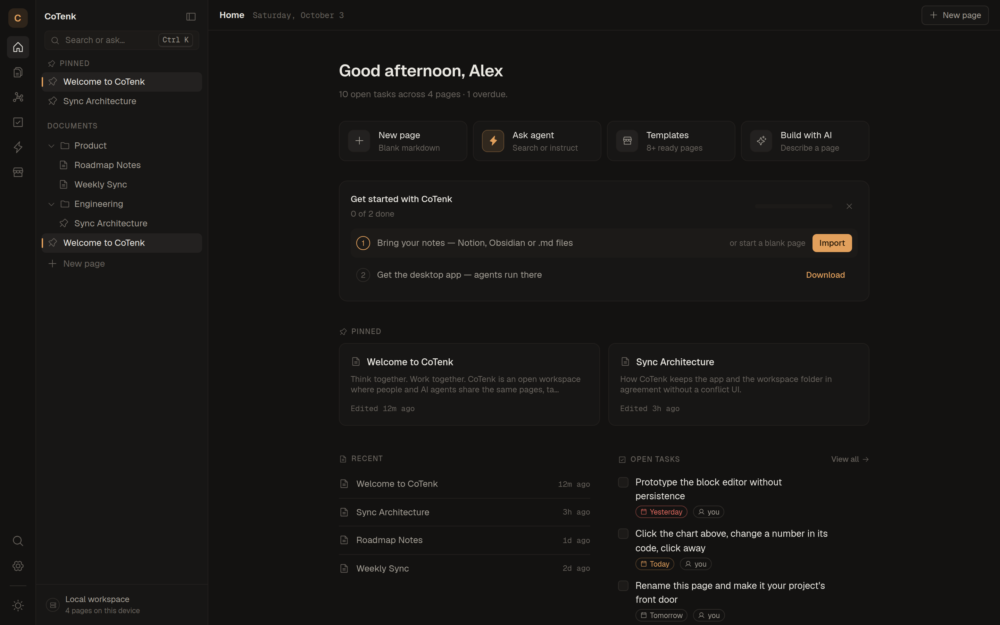
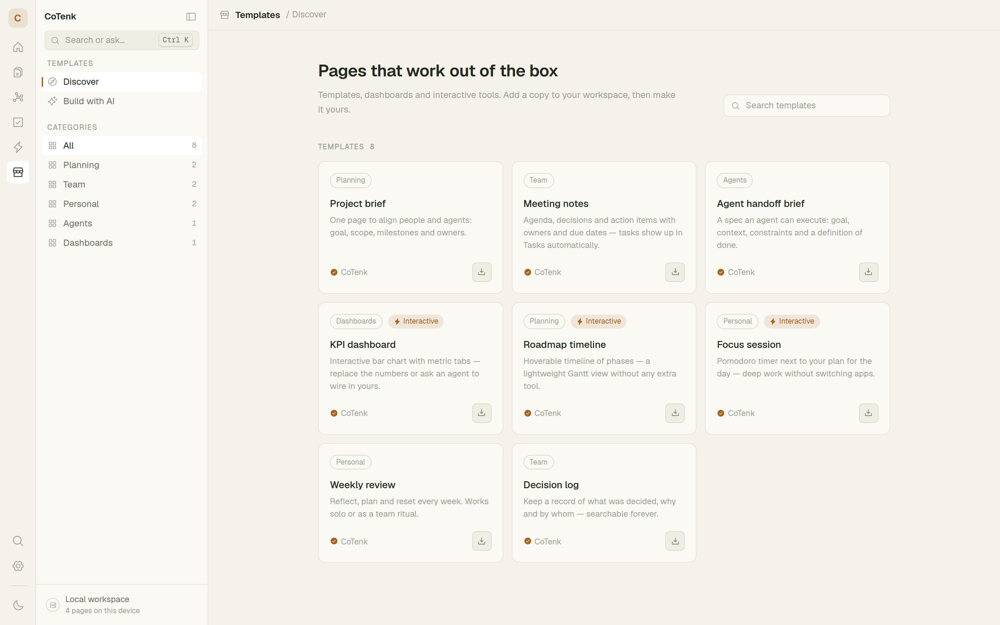

<div align="center">

# CoTenk

**Think together. Work together.**

An open-source, local-first workspace where people and AI agents share
documents, tasks and context. Your agent writes into the same pages you do.

No account · no server · no telemetry · plain `.md` files · bring your own agent
(Claude Code or Devin CLI)



</div>

## Why CoTenk

- **Your notes stay yours.** Every page is a plain markdown file in your
  workspace folder (`~/Documents/CoTenk` by default). Back it up, put it
  in git, open it in Obsidian or any editor.
- **Agents work on the real files.** Claude Code or Devin CLI edit the
  `.md` files on disk. The open page follows along live, every block an
  agent wrote lights up, and Ctrl+Z takes it back.
- **One place for pages, tasks and agents.** Any `- [ ]` on any page is
  a task you can hand to an agent. It ticks the task off in the page
  itself.

## Screenshots

<table>
  <tr>
    <td width="50%"><br><sub><b>First start</b> — a live demo, then theme and agent setup. No account.</sub></td>
    <td width="50%"><br><sub><b>Pages</b> — a block editor on plain markdown, with interactive HTML embeds.</sub></td>
  </tr>
  <tr>
    <td><br><sub><b>Agents</b> — chat with Claude Code or Devin CLI; they read and write your pages.</sub></td>
    <td><br><sub><b>Graph</b> — pages, folders, people and agents as a live map.</sub></td>
  </tr>
  <tr>
    <td><br><sub><b>Tasks</b> — every checkbox across all pages, as a list or a board by due date.</sub></td>
    <td><br><sub><b>Home</b> — quick actions, pinned and recent pages, your open tasks.</sub></td>
  </tr>
  <tr>
    <td colspan="2"><br><sub><b>Templates</b> — ready pages, some interactive, plus “Build with AI”: describe a page, your agent builds it.</sub></td>
  </tr>
</table>

## How it works

Desktop app built with **Tauri + React + TypeScript + Tailwind CSS**.
Pages, chats, history and settings stay on your machine.

Agents run locally through the [Agent Client Protocol](https://agentclientprotocol.com)
(ACP). You bring your own agent:

- **Claude Code** — through the `@agentclientprotocol/claude-agent-acp`
  adapter, using your Claude login.
- **Devin CLI** — `devin acp`, using your Devin login.

The Rust backend spawns and owns one subprocess per agent, the frontend
speaks JSON-RPC over it. Each chat is bound to one agent; Settings →
Agents shows the connection state and the default. On first start the
desktop app asks which agents to use and walks through setting each one
up (`src/components/agents/agent-onboarding.tsx`).

## Quick start

```bash
git clone https://github.com/alexn236/cotenk.git
cd cotenk
npm install
npm run tauri:dev    # desktop app (needs Rust + Tauri prerequisites)
npm run dev          # or: browser only, without agents
```

Then connect an agent from Home → "Connect an agent" — details under
[Setting up an agent](#setting-up-an-agent).

## What's inside

- **Pages** — Notion-style block editor on top of plain markdown. Slash
  menu (`/`) for headings, to-dos, tables, callouts, code, images, files
  and embeds.
- **Interactive embeds** — self-contained HTML blocks rendered in a
  sandboxed iframe. The app theme is injected as `--ck-*` CSS variables
  so agent-built widgets match light and dark mode. Widgets keep state
  across reloads with `cotenk.save(data)` / `cotenk.state` (stored in
  the block itself).
- **Import** — drop a Notion export (.zip), an Obsidian vault or .md
  files anywhere on the window (or Import notes in the sidebar/palette).
  Links become `[[wikilinks]]`, Notion CSV databases become tables.
- **Page links** — `[[Page title]]` links pages; every page lists its
  backlinks under “Linked from”. Pages can be dragged into folders.
- **Agents in the workspace** — "Ask agent" on every page, "Hand to
  agent" on every task. The agent edits the real file on disk; the open
  page follows the change live — every block it writes lights up with an
  "agent" tag — and Ctrl+Z reverts it.
- **Graph** — a live map of your pages, the folders they sit in and the
  people and agents their open tasks belong to. `[[Links]]` and subpages
  connect pages; drag, zoom, hover to light up a neighborhood, click to
  open. A small force simulation on a canvas, no library.
- **Tasks** — every `- [ ]` across all pages, with `@owner` and
  `due:YYYY-MM-DD` markers, grouped by page or due date, filterable by
  person or agent. The Board view is a kanban by due date; dragging a
  card re-dates (or ticks off) the task in its page. Ticking a task off
  gets a small burst of sparks.
- **Templates** — curated templates and "Build with AI" (describe a
  page, the agent builds it).
- **Version history** — earlier versions of every page and the pages
  deleted in the past 60 days, kept locally (page menu → Version
  history, Settings → Data & backup).
- **Export** — Settings → Data & backup writes a .zip with all pages,
  chats and attachments.
- **Command palette** — Ctrl/⌘+K: search pages, run actions, ask the agent.

## Where data lives

| What | Desktop | Browser (`npm run dev`) |
| --- | --- | --- |
| Pages | workspace folder (`.md` + frontmatter) and a local cache | `localStorage` |
| Images and files | `<workspace>/assets/` | small images inline as data URLs |
| Chats, history, settings | `localStorage` of the app | `localStorage` |
| Skills & MCP servers | app data folder (`extensions/`) | — |

Every file the app writes carries a small frontmatter block so a page
keeps its identity across renames and moves:

```markdown
---
cotenk-id: <page id>
title: <page title>
folder: <folder name or empty>
pinned: true|false
---

<markdown body>
```

Markdown files without `cotenk-id` that appear in the folder (dropped in
by you or an agent) are adopted as new pages, never deleted.

## Setting up an agent

The app walks through this itself: Home → "Connect an agent" (or
Settings → Agents → Set up) checks Node.js, runs the npm install in a
terminal window and starts the sign-in. By hand:

### Claude Code

```bash
npm install -g @anthropic-ai/claude-code              # the CLI
claude auth login                                      # or "Connect" in Settings → Agents
npm install -g @agentclientprotocol/claude-agent-acp   # optional: faster start
```

Without the global adapter the app falls back to `npx -y
@agentclientprotocol/claude-agent-acp` (first start takes ~10 s).
`CLAUDE_ACP_BIN` overrides the adapter command.

### Devin CLI

Install Devin CLI with its own installer and sign in (`devin auth
login`, or "Connect" in Settings → Agents). `DEVIN_CLI` overrides the
binary. An API key can also be pasted in Settings → Agents.

Agent edits and commands are **reviewed** by default: the app shows the
change as a block diff and asks before it lands (Settings → Agents →
Agent changes → Auto-approve turns that off). Reads never ask.

### Skills & MCP servers

Settings → Agent customisation manages skills and MCP servers that are
**only usable inside CoTenk** — nothing goes into `~/.claude` or Devin's
user config, so `claude` / `devin` run outside the app can't use them:

- **Claude Code** — everything is handed over per ACP session
  (`session/new`): skills are written to
  `<app data>/extensions/cotenk/` and loaded as a session plugin
  (`_meta.claudeCode.options.plugins`, skills appear as `cotenk:<name>`);
  MCP servers go into `mcpServers` (command or URL).
- **Devin CLI** — ignores `mcpServers` from `session/new`. So the
  workspace's `.devin/mcp_config.local.json` lists one server, the
  CoTenk gateway (`cotenk --mcp-gateway <config>`, see
  `src-tauri/src/mcp_gateway.rs`). It offers `load_skill` and proxies
  the enabled MCP servers as `<server>__<tool>` (URL servers through
  `npx mcp-remote`) — but only to Devin processes CoTenk started with
  this run's `COTENK_GATEWAY_TOKEN`. A plain `devin` in the workspace
  sees the server with no tools.

The workspace guide (`src/lib/agent/cotenk-skill.md`) ships the same way
as the built-in `cotenk-workspace` skill. Secret values (env vars,
headers) are stored apart from the list.

## Development

Prerequisites: Node.js, Rust (`rustup`) and the
[Tauri prerequisites](https://tauri.app/start/prerequisites/) for your
OS (on Windows the MSVC build tools, on Linux `libwebkit2gtk-4.1-dev`
and friends).

```bash
npm install
npm run tauri:dev    # vite dev server + desktop window
npm run dev          # frontend only, in the browser (agents disabled)
npm run typecheck    # tsc
npm run lint         # eslint
npm run build        # production frontend bundle → dist/
npm run tauri:build  # packaged desktop app
```

No environment variables are required. Optional:
`VITE_DESKTOP_DOWNLOAD_URL` is where the browser build sends people for
the desktop app (defaults to this repository's latest release).

### Project layout

```
src/
  components/   React views (editor, agents, tasks, settings, shell, …)
  lib/          state (zustand stores), file mirror, ACP client, importer, …
src-tauri/
  src/lib.rs          agent processes, file system, watcher
  src/mcp_gateway.rs  MCP gateway for Devin CLI
```

## License

[MIT](LICENSE)
