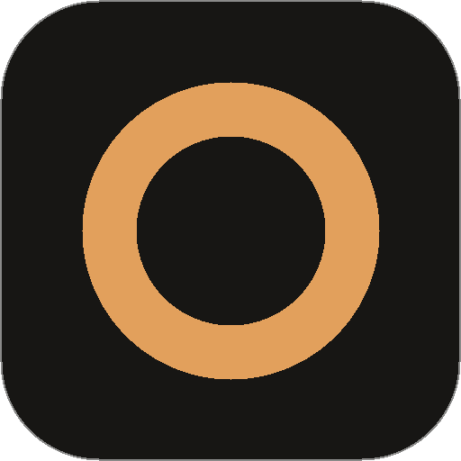

<div align="center">



# CoTenk

### The open-source AI workspace — on your machine, with your own agents.

One space for your notes, tasks and AI agents. Your agent doesn't chat *about*
your work — it opens the page and writes into it, while you watch.

[](https://github.com/alexn236/cotenk/releases/latest)
[](LICENSE)
[](https://tauri.app)
[](#-why-cotenk)
[](#-why-cotenk)

[Download](#-download) · [Why CoTenk](#-why-cotenk) · [Features](#-what-you-get) · [Build from source](#-build-from-source) · [Docs](#-docs)

<br>


<sub>Claude Code writing into a page. Every block it touched lights up — <kbd>Ctrl</kbd> <kbd>Z</kbd> takes it back.</sub>

</div>

<br>

## 💡 Why CoTenk

AI workspaces are great — until you notice your notes live on someone
else's server, in a format you can't take with you, with an assistant you
didn't choose.

CoTenk flips that:

- **🗂️ Your files, not our cloud.** Every page is a plain `.md` file in a
  folder on your disk. No account. No server. No telemetry. Open it in
  Obsidian, put it in git, grep it.
- **🤖 Bring your own agent.** Claude Code or Devin CLI — the agents you
  already pay for and trust. They work on the real files, with your skills
  and MCP servers.
- **✍️ Agents that write, not just talk.** Ask on any page, hand off any
  task. The agent edits the page live, ticks the task off when it's done,
  and asks before it changes anything.

> **Think together. Work together.** A space where you and your agents share
> the same pages, the same tasks and the same context.

| | Hosted AI workspaces | **CoTenk** |
| --- | :---: | :---: |
| Open source | ❌ | ✅ MIT |
| Your notes stay on your machine | ❌ | ✅ |
| Plain markdown you can take anywhere | ❌ | ✅ |
| Use the agent CLI you already have (Claude Code, Devin) | ❌ | ✅ |
| Agent edits real files, live | ❌ | ✅ |
| No account — notes work offline | ❌ | ✅ |

## ✨ What you get

- **Pages** — a Notion-style block editor on plain markdown. `/` for
  headings, to-dos, tables, callouts, code, images and files.
- **Live agent edits** — blocks an agent writes glow as they land. Review
  every change as a diff, undo with one key.
- **Tasks everywhere** — any `- [ ]` on any page is a task. `@claude` it
  and the agent does it. List or kanban board by due date.
- **Read along** — the page the agent is writing opens next to the chat,
  so you can follow every change as it happens.
- **Interactive pages** — agents build widgets (charts, trackers, timers)
  as plain HTML right inside your notes.
- **Websites & apps** — ask for a landing page or a small app and get a
  real, multi-page site; **Export site** turns it into a folder you can
  put on any static host.
- **Graph** — your pages, folders, people and agents as a live map.
- **Build with AI** — describe a page, your agent builds it. Or start
  from a template.
- **Import in seconds** — drop a Notion export or an Obsidian vault on
  the window.
- **Skills & MCP** — give your agents extra skills and MCP servers that
  only exist inside CoTenk.
- **Yours to keep** — version history, recently deleted, one-click
  export of everything.

## 📥 Download

| Platform | Get it |
| --- | --- |
| Windows | `CoTenk_x.y.z_x64-setup.exe` |
| macOS (Apple Silicon / Intel) | `CoTenk_x.y.z_aarch64.dmg` / `CoTenk_x.y.z_x64.dmg` |
| Linux | `.AppImage` or `.deb` |

All files are on the **[latest release](https://github.com/alexn236/cotenk/releases/latest)**.
Then click **Connect an agent** on Home — CoTenk installs Claude Code (or
finds Devin CLI) and walks you through sign-in. That's it.

> The builds aren't code-signed yet. On Windows, SmartScreen may warn —
> click *More info → Run anyway*. On macOS, right-click the app → *Open*
> the first time.

## 🔧 Build from source

```bash
git clone https://github.com/alexn236/cotenk.git
cd cotenk
npm install
npm run tauri:dev
```

Needs Node.js, Rust and the [Tauri prerequisites](https://tauri.app/start/prerequisites/).
Just want to look around? `npm run dev` runs it in the browser (without
agents). More in [Development](#-docs).

## 🤝 Contributing

CoTenk is early and moving fast — that's the best time to shape it.

- Found a bug or have an idea? [Open an issue](https://github.com/alexn236/cotenk/issues/new).
- Want to fix something? Fork, branch, and open a pull request against
  `main` — `npm run typecheck` and `npm run lint` should pass.
- New to the code? The *Development* section under [Docs](#-docs) has the
  project layout.

If CoTenk is useful to you, a ⭐ helps other people find it.

## 📚 Docs

<details>
<summary><b>How it works</b></summary>

<br>

Desktop app built with **Tauri + React + TypeScript + Tailwind CSS**.
Agents run locally through the [Agent Client Protocol](https://agentclientprotocol.com)
(ACP): the Rust backend spawns one subprocess per agent, the frontend
speaks JSON-RPC over it. Each chat is bound to one agent.

- **Claude Code** — through the `@agentclientprotocol/claude-agent-acp`
  adapter, using your Claude login.
- **Devin CLI** — `devin acp`, using your Devin login.

#### Where data lives

| What | Desktop | Browser (`npm run dev`) |
| --- | --- | --- |
| Pages | workspace folder (`.md` for markdown, `.html` for artifact pages) and a local cache | `localStorage` |
| Images and files | `<workspace>/assets/` | small images inline as data URLs |
| Chats, history, settings | `localStorage` of the app | `localStorage` |
| Skills & MCP servers | app data folder (`extensions/`) | — |

Every file the app writes carries a small frontmatter block so a page
keeps its identity across renames and moves:

```markdown
---
cotenk-id: <page id>
title: <page title>
folder: <folder name or empty>
pinned: true|false
---

<markdown body>
```

Artifact pages (apps, tools, websites) are `.html` files that carry the
same identity in one comment right after the doctype:

```html
<!doctype html>
<!-- cotenk: {"id":"<page id>","title":"<page title>","folder":"","pinned":false} -->
<html>…
```

Page files without an identity that appear in the folder (dropped in by
you or an agent) are adopted as new pages, never deleted. Files in
`assets/` are attachments, not pages.

</details>

<details>
<summary><b>Setting up an agent</b></summary>

<br>

The app walks through this itself: Home → "Connect an agent" (or
Settings → Agents → Set up) checks Node.js, runs the npm install in a
terminal window and starts the sign-in. By hand:

#### Claude Code

```bash
npm install -g @anthropic-ai/claude-code              # the CLI
claude auth login                                      # or "Connect" in Settings → Agents
npm install -g @agentclientprotocol/claude-agent-acp   # optional: faster start
```

Without the global adapter the app falls back to `npx -y
@agentclientprotocol/claude-agent-acp` (first start takes ~10 s).
`CLAUDE_ACP_BIN` overrides the adapter command.

#### Devin CLI

Install Devin CLI with its own installer and sign in (`devin auth
login`, or "Connect" in Settings → Agents). `DEVIN_CLI` overrides the
binary. An API key can also be pasted in Settings → Agents.

Agent edits and commands are **reviewed** by default: the app shows the
change as a block diff and asks before it lands. You pick Review or
Auto-approve during onboarding and can switch any time in Settings →
Agents → Agent changes. Reads never ask.

#### Skills & MCP servers

Settings → Agent customisation manages skills and MCP servers that are
**only usable inside CoTenk** — nothing goes into `~/.claude` or Devin's
user config, so `claude` / `devin` run outside the app can't use them:

- **Claude Code** — everything is handed over per ACP session
  (`session/new`): skills are written to
  `<app data>/extensions/cotenk/` and loaded as a session plugin
  (`_meta.claudeCode.options.plugins`, skills appear as `cotenk:<name>`);
  MCP servers go into `mcpServers` (command or URL).
- **Devin CLI** — ignores `mcpServers` from `session/new`. So the
  workspace's `.devin/mcp_config.local.json` lists one server, the
  CoTenk gateway (`cotenk --mcp-gateway <config>`, see
  `src-tauri/src/mcp_gateway.rs`). It offers `load_skill` and proxies
  the enabled MCP servers as `<server>__<tool>` (URL servers through
  `npx mcp-remote`) — but only to Devin processes CoTenk started with
  this run's `COTENK_GATEWAY_TOKEN`. A plain `devin` in the workspace
  sees the server with no tools.

The workspace guide (`src/lib/agent/cotenk-skill.md`) ships the same way
as the built-in `cotenk-workspace` skill. Secret values (env vars,
headers) are stored apart from the list.

</details>

<details>
<summary><b>Development</b></summary>

<br>

Prerequisites: Node.js, Rust (`rustup`) and the
[Tauri prerequisites](https://tauri.app/start/prerequisites/) for your
OS (on Windows the MSVC build tools, on Linux `libwebkit2gtk-4.1-dev`
and friends).

```bash
npm install
npm run tauri:dev    # vite dev server + desktop window
npm run dev          # frontend only, in the browser (agents disabled)
npm run typecheck    # tsc
npm run lint         # eslint
npm run build        # production frontend bundle → dist/
npm run tauri:build  # packaged desktop app
```

No environment variables are required. Optional:
`VITE_DESKTOP_DOWNLOAD_URL` is where the browser build sends people for
the desktop app (defaults to this repository's latest release).

#### Project layout

```
src/
  components/   React views (editor, agents, tasks, settings, shell, …)
  lib/          state (zustand stores), file mirror, ACP client, importer, …
src-tauri/
  src/lib.rs          agent processes, file system, watcher
  src/mcp_gateway.rs  MCP gateway for Devin CLI
```

</details>

## 📄 License

[MIT](LICENSE) — do whatever you want, just keep the notice.

<sub>CoTenk is an independent open-source project and is not affiliated with,
endorsed by or sponsored by Anthropic, Cognition, Notion, Obsidian or
OpenAI. Claude Code, Devin and the other product names mentioned here are
trademarks of their respective owners and are used only to describe
compatibility.</sub>
